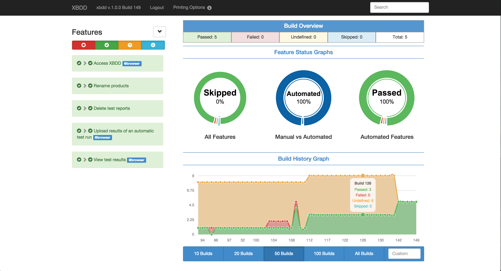
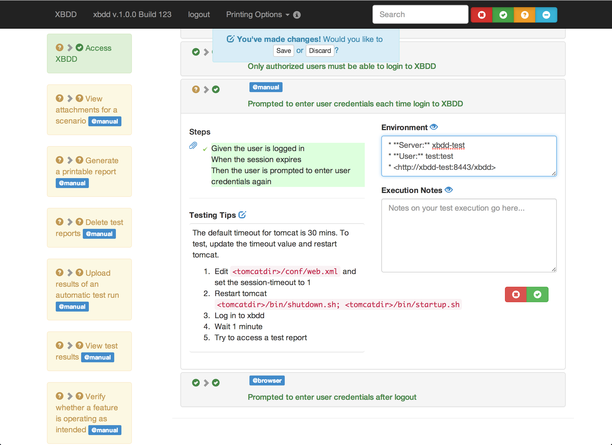

XBDD User Guide
=====================

XBDD is a tool to unite automated and manual test effort. This guide covers the
basic features of the XBDD.

Reports
-------

XBDD reports are a combination of Cucumber json reports augmented with data from
humans.

To view a report, select a product, version and build from the XBDD home page.

When viewing a report, printing options are available in the header to view or download
a single page version of the report.

### Features

A feature represents one of more User Stories and a collection of scenarios that
describe an area of the product's functionality.

The overall status of the feature is the aggregate of all scenarios. The features status
will pass if all scenarios are passing.

Select a feature to view the description and a list of scenarios.

### Scenarios

A scenario captures one specific piece of the product's behaviour and is made up
of a collection of steps. Like a feature, all steps must be passing for the scenario
to be passed.

Select a scenario to view the steps, attachments and manual test information.

Manual Verification
-------------------

When first viewing a report, the status of the scenarios represents the results
of the automated test run. An undefined (yellow) or skipped (blue) status
indicates that the tests is not automated and requires manual verification.

To pass or fail an individual step, click on the text until the desired state is
shown. To pass or fail all scenarios, use the buttons at the bottom of the scenario.

[Testing Tips](#tips), [Environment](#environment), and [Execution Notes](#notes)
 are editable and support markdown annotation.

*Don't forget to save your changes after editing the status or test notes*

### Testing Tips

Select a scenario to test. The Testing Tips section contains instructions on how
to configure and set up the scenario providing addition information not captured
by the steps.

The testing tips are saved for all later reports and can be updated in a later
build or version.

### Environment

When verifying a scenario, the environment field is used to capture details about
the test environment used.

The environment is specific to a single report only.

### Execution Notes

Include notes on the manual verification, including details about failures encountered.

The execution notes are specific to a single report only.
